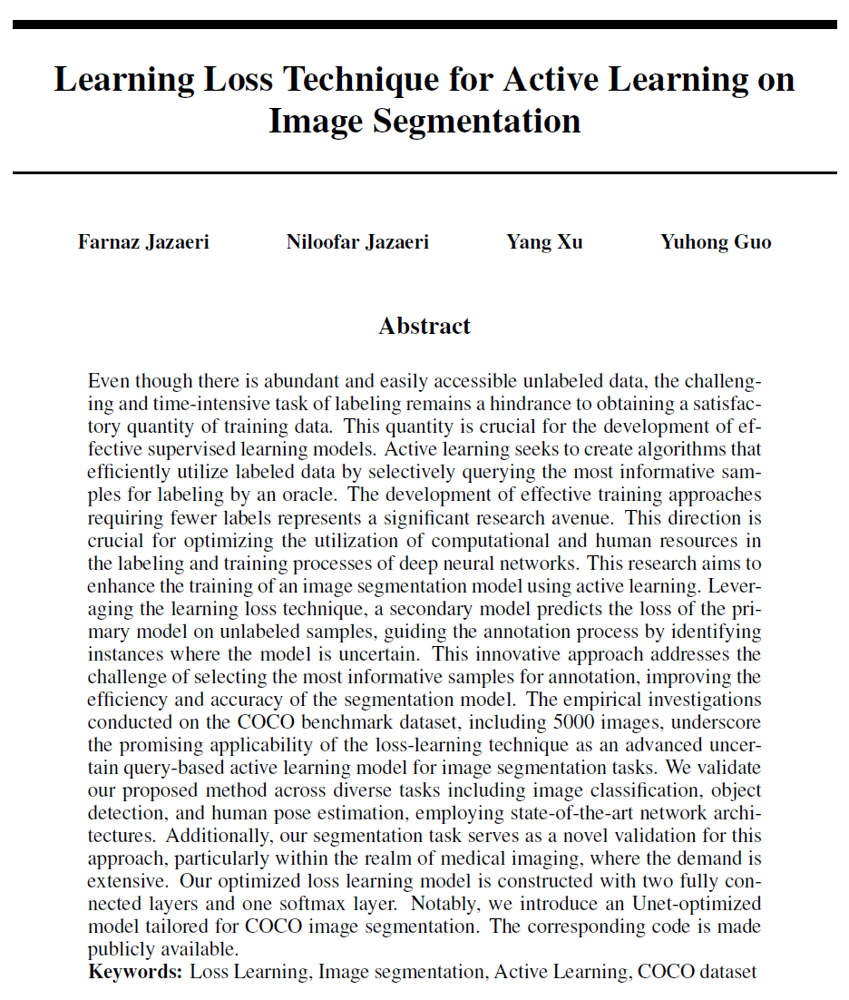
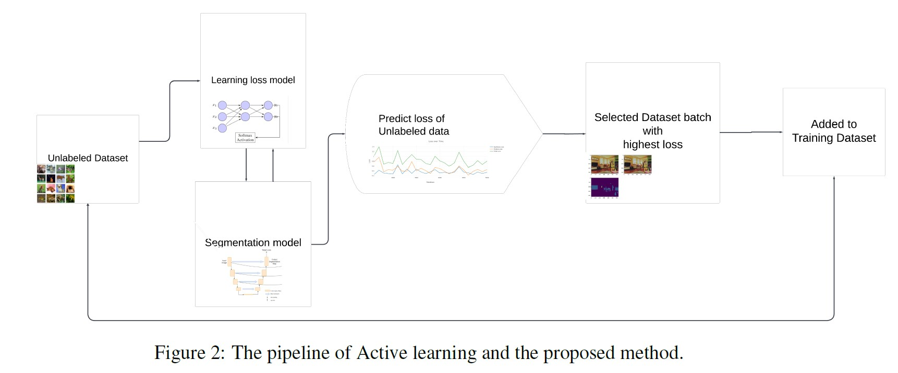
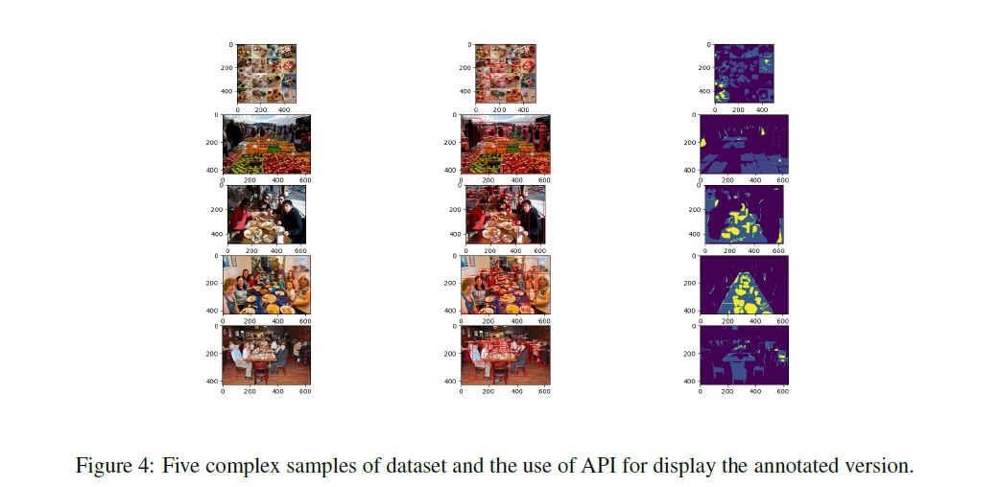
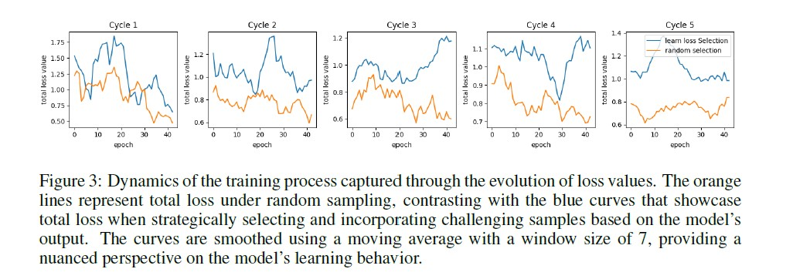

# Learning Loss for Active Learning in Image Segmentation

**Farnaz Jazaeri · Niloofar Jazaeri · Yang Xu · Yuhong Guo**  
[Report (PDF)](paper/FinalReport.pdf) · [Code](src/) · [Results](results/)  

<p align="center">
  
</p>

## Problem (for ML/Data Science readers)
High-quality labels are expensive—especially for **segmentation**, where each image needs **pixel-level masks**.  
Active learning reduces labeling cost by repeatedly selecting the **most informative unlabeled samples** for annotation rather than labeling everything.

In this project, we implement **Learning Loss**: a small auxiliary network predicts the *future loss* of the main model on unlabeled images and uses that predicted loss as an **uncertainty score** for querying the next images to label. This focuses annotation on samples the model is most likely to get wrong.

---

## Method Overview

### Key idea: "Learn to query what the model struggles with"
We train:
1) **Target model:** a UNet segmentation network  
2) **Loss prediction module:** predicts the segmentation loss for an unlabeled sample using intermediate UNet feature maps

Then we query (select) the unlabeled samples with **highest predicted loss**, label them, and retrain in cycles.

<p align="center">
  
</p>

**Query rule (pool-based AL):**  
Select **K** samples from the unlabeled pool with maximum predicted loss:
`Xs = argmax LossPred(S(Xs))`

---

## Architecture

### Target model: UNet
We use UNet (encoder–decoder with skip connections) as the segmentation backbone. :contentReference[oaicite:0]{index=0}

### Loss prediction module
Feature maps from multiple UNet layers → Global Average Pooling → FC + ReLU → concatenation → FC → predicted loss (scalar).  
This follows the Learning Loss formulation originally proposed for task-agnostic active learning. ```:contentReference[oaicite:1]{index=1}```

---

## Dataset
We validate on **MS COCO 2017** segmentation, using the COCO API for loading images and masks. ```:contentReference[oaicite:2]{index=2}```

<p align="center">
  
</p>

---

## Results

### Training dynamics
Learning-loss sampling tends to pick **harder** images, leading to higher loss early in cycles (expected), but improves learning efficiency over random sampling.

<p align="center">
  
</p>

### Table: Minimum loss values under different λ (from report)
| λ | Random: Lseg | Random: Total | LearnLoss: Lseg | LearnLoss: Total |
|---:|---:|---:|---:|---:|
| 0.0 | 0.028 | 0.202 | 0.024 | 0.235 |
| 0.5 | 0.034 | 0.189 | 0.093 | 0.167 |
| 1.0 | 0.070 | 0.099 | 0.035 | 0.254 |
| 1.5 | 0.069 | 0.143 | 0.144 | 0.209 |
| 2.0 | 0.026 | 0.298 | 0.093 | 0.164 |

> In our experiments, λ = 2 produced the lowest LearnLoss total loss in this table (Table 1).

---

## Reproducibility (Recommended)
### Environment
- Python 3.10+
- PyTorch
- pycocotools
- numpy, tqdm, matplotlib

### Minimal run (example)
```bash
# 1) install deps
pip install -r requirements.txt

# 2) download COCO 2017 (see data/README.md)
# 3) run training with active learning
python src/train_active_learning.py --dataset coco2017 --k 1000 --lambda_loss 2.0 --epochs 50
```
## References
<details>
<summary>Click to expand (31 references)</summary>

[1] Burr Settles. *Active Learning Literature Survey*. Technical Report, University of Wisconsin–Madison, 2009.  
Link: https://burrsettles.com/pub/settles.activelearning.pdf :contentReference[oaicite:0]{index=0}

[2] DeepAI. *Active Learning*. May 2019.  
Link: https://deepai.org/machine-learning-glossary-and-terms/active-learning :contentReference[oaicite:1]{index=1}

[3] Geert Litjens et al. *A survey on deep learning in medical image analysis*. Medical Image Analysis, 42:60–88, 2017.  
Link: https://pubmed.ncbi.nlm.nih.gov/28778026/ :contentReference[oaicite:2]{index=2}

[4] Paulo R. Vieira, Pedro D. Félix, and Luis Macedo. *Open-World Active Learning with Stacking Ensemble for Self-Driving Cars*. arXiv, 2021.  
(Link: add your arXiv URL if you have it)

[5] Sudhanshu Mittal, Joshua Niemeijer, Jörg P. Schäfer, and Thomas Brox. *Best Practices in Active Learning for Semantic Segmentation*. arXiv, 2023.  
Link: https://arxiv.org/abs/2302.04075 :contentReference[oaicite:3]{index=3}

[6] Donggeun Yoo and In So Kweon. *Learning Loss for Active Learning*. arXiv, 2019.  
Link: https://arxiv.org/abs/1905.03677 :contentReference[oaicite:4]{index=4}

[7] Alaa Tharwat and Wolfram Schenck. *A Survey on Active Learning: State-of-the-Art, Practical Challenges and Research Directions*. Mathematics, 11(4):820, 2023.  
Link: https://www.mdpi.com/2227-7390/11/4/820 :contentReference[oaicite:5]{index=5}

[8] Choi Junhwan, Oh Seokmin, and Byun Joongmoo. *Uncertainty estimation in AVO inversion using Bayesian dropout based deep learning*. Journal of Petroleum Science and Engineering, 208:109288, 2022.  
(Link: add journal link/DOI if you have it)

[9] Ozan Sener and Silvio Savarese. *Active Learning for Convolutional Neural Networks: A Core-Set Approach*. arXiv, 2017.  
Link: https://arxiv.org/abs/1708.00489 :contentReference[oaicite:6]{index=6}

[10] Neil Houlsby, Ferenc Huszár, Zoubin Ghahramani, and Máté Lengyel. *Bayesian Active Learning for Classification and Preference Learning*. arXiv, 2011.  
Link: https://arxiv.org/abs/1112.5745 :contentReference[oaicite:7]{index=7}

[11] Vincent Vercruyssen et al. *Multi-domain Active Learning for Semi-supervised Anomaly Detection*. In ECML PKDD, 2023.  
(Link: add Springer link if you have it)

[12] Xing Wu et al. *Federated Active Learning for Multicenter Collaborative Disease Diagnosis*. IEEE TMI, 2023.  
(Link: add IEEE link/DOI if you have it)

[13] Yi Li et al. *Fully Convolutional Instance-Aware Semantic Segmentation*. CVPR, 2017.  
(Link: add IEEE link/DOI if you have it)

[14] A. Kapoor, R.W. Picard, and Y. Ivanov. *Probabilistic combination of multiple modalities to detect interest*. ICPR, 2004.  
(Link: add IEEE link if you have it)

[15] Giulia DeSalvo, Claudio Gentile, and Tobias Sommer Thune. *Online active learning with surrogate loss functions*. NeurIPS, 2021.  
(Link: add proceedings link if you have it)

[16] Nguyen Viet Cuong, Wee Sun Lee, and Nan Ye. *Near-optimal adaptive pool-based active learning with general loss*. UAI, 2014.

[17] Chuanbing Wan et al. *Unsupervised active learning with loss prediction*. Neural Computing and Applications, 2021.

[18] Tianxiang Yin, Ningzhong Liu, and Han Sun. *Self-paced active learning for deep CNNs via effective loss function*. Neurocomputing, 2021.

[19] Ilya Makarov and Ivan Guschenko-Cheverda. *Learning loss for active learning in depth reconstruction problem*. IEEE CINTI, 2021.

[20] Megh Shukla and Shuaib Ahmed. *A mathematical analysis of learning loss for active learning in regression*. CVPR, 2021.

[21] Bo Long et al. *Active learning for ranking through expected loss optimization*. SIGIR, 2010.

[22] Reza Shokri and Vitaly Shmatikov. *Privacy-Preserving Deep Learning*. ACM CCS, 2015.

[23] Phil Ammirato et al. *A Dataset for Developing and Benchmarking Active Vision*. arXiv, 2017.

[24] Ali Mottaghi and Serena Yeung. *Adversarial Representation Active Learning*. arXiv, 2019.

[25] Olaf Ronneberger, Philipp Fischer, and Thomas Brox. *U-Net: Convolutional Networks for Biomedical Image Segmentation*. arXiv, 2015.  
Link: https://arxiv.org/abs/1505.04597 :contentReference[oaicite:8]{index=8}

[26] Alaa Tharwat and Wolfram Schenck. *Balancing Exploration and Exploitation: A novel active learner for imbalanced data*. Knowledge-Based Systems, 2020.  
(Link: add ScienceDirect link/DOI if you have it)

[27] Rinu Boney and Alexander Ilin. *Semi-Supervised and Active Few-Shot Learning with Prototypical Networks*. arXiv, 2017.

[28] Christoph H. Lampert, Hannes Nickisch, and Stefan Harmeling. *Attribute-Based Classification for Zero-Shot Visual Object Categorization*. IEEE TPAMI, 2014.

[29] Zongwei Zhou et al. *UNet++: A Nested U-Net Architecture for Medical Image Segmentation*. arXiv, 2018.  
Link: https://arxiv.org/abs/1807.10165 :contentReference[oaicite:9]{index=9}

[30] Tsung-Yi Lin et al. *Microsoft COCO: Common Objects in Context*. arXiv, 2014.  
Link: https://arxiv.org/abs/1405.0312 :contentReference[oaicite:10]{index=10}

[31] cocodataset. *cocoapi (COCO API)*.  
Link: https://github.com/cocodataset/cocoapi :contentReference[oaicite:11]{index=11}

</details>
